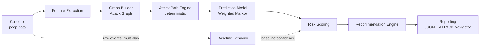

# SentinelPath AI


[](https://github.com/astral-sh/ruff)

**Predict the attacker's next move — with explainable, evidence-based probabilities.**

[Türkçe README](README_TR.md)

## Why SentinelPath AI?

✓ Ranks the most likely next attack techniques from a partially observed attack path
✓ Grounded in MITRE ATT&CK — every prediction maps to a technique ID
✓ Explainable risk scoring — every number has a traceable rationale

Many security monitoring and detection platforms are optimized
primarily for identifying and responding to observed or ongoing
activity, and modern EDR/NDR products increasingly include behavioral
detection, threat hunting, and anomaly-scoring capabilities. SentinelPath
AI explores a complementary question that most of these tools don't
expose directly to the user: **given a partially observed attack path,
which technique is most likely to occur next, and why?** Academic
attack-graph research (MulVAL, TVA) tends to rely on static
vulnerability graphs; SentinelPath AI instead builds a continuously
updated *behavioral* attack graph and ranks candidate next steps
probabilistically against it, with every ranking traceable back to
observed evidence.

> This is not an anomaly/alerting system. The goal is not to detect
> "what happened," but to answer, in a traceable and explainable way,
> **"what's next?"** given a partially observed attack chain.

## Architecture



Note that Baseline Behavior consumes the raw event stream directly (not
the built graph) over a wider, multi-day window — see ADR 0006.

The system follows **Hexagonal Architecture (Ports & Adapters)** combined
with a pipeline data flow. For the full diagram, layer-by-layer
rationale, and Architecture Decision Records, see
**[ARCHITECTURE.md](ARCHITECTURE.md)**.

## Installation

```bash
# Create a virtual environment
python3 -m venv .venv
source .venv/bin/activate  # Windows: .venv\Scripts\activate

# Install core dependencies
pip install -e .

# Add development dependencies
pip install -e ".[dev]"

# Optional feature groups (as needed):
pip install -e ".[api]"      # FastAPI + uvicorn
pip install -e ".[network]"  # Scapy (for passive network parsing)
pip install -e ".[ml]"       # scikit-learn, xgboost
pip install -e ".[gnn]"      # torch (Graph Neural Network, Phase 6+)
```

For environment variables, create a `.env` file (see
`src/sentinelpath/config/settings.py` for supported fields, all
prefixed with `SENTINELPATH_`):

```env
SENTINELPATH_ENVIRONMENT=development
SENTINELPATH_LOG_LEVEL=INFO
SENTINELPATH_LOG_FORMAT=console
```

## Usage

### Running the tests

```bash
pip install -e ".[dev]"
pytest                                            # all Python tests
node tests/dashboard/test_app_pure_functions.js   # dashboard JS tests (requires Node.js)
```

### Network Parser (Collector) — Phase 2

The first concrete Collector adapter turns a `.pcap` file into a list
of `NormalizedEvent`. Requires Scapy:

```bash
pip install -e ".[network]"
```

```python
from sentinelpath.collector.infrastructure.pcap_adapter import PcapFileCollector

collector = PcapFileCollector(pcap_path="capture.pcap")
events = collector.collect()

for event in events:
    print(event.source_host, "->", event.target_host, event.raw_action, event.mitre_technique_id)
```

Example output (for a capture containing RDP and SMB traffic):

```
10.0.0.5 -> 10.0.0.10 tcp_connect:rdp T1021.001
10.0.0.5 -> 10.0.0.11 tcp_connect:smb_admin_shares T1021.002
10.0.0.7 -> 10.0.0.10 tcp_connect:port_8080 None
```

**Design note:** for the split between Scapy-dependent I/O and pure
translation logic, see
[ADR 0003](docs/adr/0003-pure-translation-vs-framework-io-split.md).
The translation logic (`packet_translation.py`) is testable via
`tests/test_packet_translation.py` even when Scapy is **not** installed.

### Feature Extraction — Phase 3

A rule-based (no pandas required) extractor that turns a list of
`NormalizedEvent` into a `HostFeatureVector`:

```python
from datetime import datetime, timezone
from sentinelpath.feature_extraction.infrastructure.rule_based_extractor import (
    RuleBasedFeatureExtractor,
)

extractor = RuleBasedFeatureExtractor()  # reads business-hour defaults from settings
vector = extractor.extract(
    host_id="10.0.0.5",
    events=events,  # NormalizedEvent list, e.g. from Phase 2's PcapFileCollector
    window_start=datetime(2026, 1, 1, tzinfo=timezone.utc),
    window_end=datetime(2026, 1, 2, tzinfo=timezone.utc),
)

print(vector.distinct_users_count, vector.failed_auth_ratio, vector.observed_techniques)
```

Example output:

```
distinct_users_count=2 failed_auth_ratio=0.33 observed_techniques=('T1021.001', 'T1021.002')
```

**Design note:** `FeatureExtractorPort` gained an explicit time window
in Phase 3 — see [ADR 0004](docs/adr/0004-explicit-feature-window.md).
For the rationale behind choosing pure Python over pandas, see the
Phase 3 notes in ARCHITECTURE.md.

### Graph Builder — Phase 4

A NetworkX-based adapter that turns a list of `NormalizedEvent` and a
host inventory into an `AttackGraphSnapshot`:

```python
from sentinelpath.graph_builder.infrastructure.networkx_adapter import NetworkXGraphBuilder

builder = NetworkXGraphBuilder()
snapshot = builder.build(events=events, feature_vectors=feature_vectors)

for edge in snapshot.edges:
    print(edge.source_node, "->", edge.target_node, edge.relation.value, f"(weight={edge.weight})")

# To merge in static topology information (e.g. firewall/subnet access rules):
snapshot = builder.merge_static_topology(snapshot, topology_edges=[("host-a", "host-c")])
```

Example output:

```
10.0.0.5 -> 10.0.0.10 authenticates_to (weight=1.0)
10.0.0.5 -> 10.0.0.11 observed_lateral_movement (weight=3.0)
```

**Design note:** `GraphBuilderPort.build()` gained an explicit `events`
parameter in Phase 4 — see
[ADR 0005](docs/adr/0005-graph-builder-events-parameter.md). For why
`MultiDiGraph` was chosen over `DiGraph` (a single host pair can carry
more than one relation type at once), see the module docstring in
`networkx_adapter.py`.

### End-to-end demo (Phases 1–4 together)

`scripts/demo_end_to_end.py` chains the first four phases with real
inputs/outputs — it shows a lateral-movement scenario (RDP → SMB)
alongside normal daytime traffic on the same graph:

```bash
PYTHONPATH=src python3 scripts/demo_end_to_end.py
```

### Baseline Behaviour — Phase 5

Derives a "normal behavior" profile per host from a raw
`NormalizedEvent` history spanning multiple days:

```python
from sentinelpath.baseline_behavior.infrastructure.in_memory_baseline import (
    InMemoryBaselineBehavior,
)

baseline = InMemoryBaselineBehavior()
baseline.recompute(events, window_start=..., window_end=...)  # periodic/batch call

profile = baseline.get_profile("10.0.0.10")  # fast, synchronous read
print(profile.confidence, profile.typical_active_hours, profile.typical_peer_nodes)
```

**Important:** the `confidence` field reflects how many days of data
were *actually* observed relative to the requested window. To avoid
claiming "this behavior is anomalous" from too little data, the
Prediction Model in Phase 6 factors this in.

**Design note:** `BaselineBehaviorPort.recompute()` was changed in
Phase 5 to take a raw event list and an explicit window instead of an
`AttackGraphSnapshot` — see
[ADR 0006](docs/adr/0006-baseline-events-and-window.md). This class is
the first **stateful** adapter in the project (unlike the stateless
Graph Builder) — see the module docstring in `in_memory_baseline.py`.

### Attack Path Prediction — Phase 6

This is the project's core value proposition. Two separate engines
work together (see ADR 0002): the **Attack Path Engine** (deterministic,
pure graph theory) and the **Prediction Model** (probabilistic ranking).

```python
from sentinelpath.attack_path_engine.infrastructure.networkx_engine import (
    NetworkXAttackPathEngine,
)
from sentinelpath.prediction.infrastructure.weighted_markov_model import (
    WeightedMarkovPredictionModel,
)

engine = NetworkXAttackPathEngine()
candidate_paths = engine.find_candidate_paths(snapshot, start_node="10.0.0.50", max_hops=3)

predictor = WeightedMarkovPredictionModel()
result = predictor.predict(candidate_paths)

for tp in result.predictions:  # sorted by descending probability
    print(f"%{tp.probability*100:.1f}  {tp.technique_id}  {tp.technique_name}")
```

**Model selection:** several supervised and representation-learning
approaches — Random Forest, XGBoost, GNNs, Temporal GNNs, LSTMs, and
Transformers — were considered and not selected for the MVP, mainly
because the project currently lacks a sufficiently representative
labeled training dataset and evaluation framework to fit or validate
them responsibly. Isolation Forest was also considered but set aside
for a different reason: it is an unsupervised anomaly-scoring method
and does not directly model sequential attack-path transitions, which
is the actual problem being solved here. Instead, a **weighted Markov
transition model** was chosen: it produces probabilities directly from
observed graph weights (which are already an empirical observation
frequency) and requires no training data at all. See the full
comparison table and rationale in
[ADR 0009](docs/adr/0009-prediction-model-selection.md).

**Design note:** implementing this phase surfaced **two real data-loss
issues**, both fixed:
- `GraphEdge` did not carry the specific MITRE technique ID, only the
  coarse relation category — see
  [ADR 0007](docs/adr/0007-graph-edge-technique-ids.md)
- `CandidatePath` did not carry the hop-level structured data the
  Prediction Model needs to compute probabilities — see
  [ADR 0008](docs/adr/0008-candidate-path-hop-data.md)

A third issue — this version of `networkx` now requires an explicit
`target` argument for `all_simple_paths()` — surfaced during live
testing and was fixed as well.

### Risk Scoring — Phase 7

Takes a `PredictionResult` and produces a risk score (0–100) per
prediction using `probability × asset_criticality × technique_severity`:

```python
from sentinelpath.risk_scoring.infrastructure.config_based_risk_scoring import (
    ConfigBasedRiskScoring,
)

risk_scorer = ConfigBasedRiskScoring(
    asset_criticality_map={"10.0.0.20": 0.95, "10.0.0.10": 0.9},  # the organization's own asset inventory
)
risk_scores = risk_scorer.score(prediction, baseline_profiles=baseline_profiles)

for rs in risk_scores:  # sorted by descending score
    print(rs.target_node, rs.score, rs.baseline_confidence)
```

**Design note:** `RiskScore` gained a `baseline_confidence` field in
Phase 7 — but it is **not folded into the main formula**, it is carried
as separate context. See
[ADR 0010](docs/adr/0010-risk-score-baseline-confidence.md). This is a
direct answer to the "does low confidence raise or lower the score?"
ambiguity found in Phase 6: it leaves the final interpretation to the
human reader.

Values in the `TECHNIQUE_SEVERITY` table are **not** official CVSS
scores — CVSS applies to CVEs (vulnerabilities), not MITRE ATT&CK
techniques. They are reasonable, domain-informed assumptions, in the
same spirit as the `RELATION_PRIORITY` table from Phase 6.

### Recommendation Engine + Reporting — Phase 8 (final MVP phase)

**Note:** the Recommendation Engine wasn't listed as a separate phase
in the original ten-phase roadmap, but it appeared in Phase 1's own
pipeline diagram (Risk Scoring → Recommendation Engine → Reporting) —
since Reporting needs `recommendations` populated to build a
`SentinelPathReport`, the two were completed together.

```python
from sentinelpath.recommendation.infrastructure.rule_based_recommender import (
    RuleBasedRecommendationEngine,
)
from sentinelpath.reporting.infrastructure.json_reporting import JSONReporting
from sentinelpath.core.models import SentinelPathReport
from datetime import datetime, timezone

recommendations = RuleBasedRecommendationEngine().recommend(risk_scores)

report = SentinelPathReport(
    target_node="10.0.0.50", risk_scores=tuple(risk_scores),
    recommendations=tuple(recommendations),
    generated_at=datetime.now(timezone.utc), pipeline_version="0.1.0",
)

reporter = JSONReporting()
json_output = reporter.to_json(report)
navigator_layer = reporter.to_attack_navigator_layer(report)
```

Example files generated from a real pipeline run live in `examples/`:
- `examples/sample_report.json` — general-purpose JSON report
- `examples/sample_navigator_layer.json` — can be loaded directly into
  [MITRE ATT&CK Navigator](https://mitre-attack.github.io/attack-navigator/)
  via "Open Existing Layer → Upload from local"

**Design note:** the Navigator layer schema was validated against the
official MITRE spec (`layerformat.md`, v4.5) before implementation. The
`versions.attack` field is intentionally omitted — asserting a specific
ATT&CK data version would go stale as soon as the dataset is updated
(the field is optional). The risk-score gradient runs in the opposite
direction from MITRE's own example layer, since in our context a high
score is bad (red), not good.

### Dashboard — Phase 9

A **PipelineOrchestrator** (pure Python, no web-framework dependency)
chains every component from Phases 2–8; a **FastAPI application**
exposes it over HTTP; a **static HTML/vanilla-JS dashboard** visualizes
the result.

```bash
pip install -e ".[api]"
uvicorn sentinelpath.api.main:app --reload
```

Then open `http://localhost:8000/dashboard/` in a browser and click
"Run demo scenario" — a risk-score table, recommendations, and an
attack graph rendered with `vis-network` will appear. API documentation
is auto-generated at `http://localhost:8000/docs` via FastAPI's OpenAPI
support.

**Design note:** `PipelineOrchestrator` is deliberately
framework-independent, following the same split as
[ADR 0003](docs/adr/0003-pure-translation-vs-framework-io-split.md)
applied to a web framework — see
[ADR 0011](docs/adr/0011-dashboard-tech-stack.md). The dashboard's
JavaScript is split the same way: DOM-independent pure functions
(`buildGraphData`, `riskColor`, etc.) are unit-tested under Node.js
(20/20 tests, see `tests/dashboard/test_app_pure_functions.js`).

### Deployment — Phase 10

```bash
# With Docker Compose:
docker compose up --build
# http://localhost:8000/dashboard/

# Or directly with Docker:
docker build -t sentinelpath-ai .
docker run -p 8000:8000 sentinelpath-ai
```

CI/CD runs on GitHub Actions (`.github/workflows/ci.yml`): a Python
3.11/3.12 matrix, `ruff` lint, `mypy` type checking, the full `pytest`
suite with the CI-supported optional dependency groups (`api`,
`network`, `ml`), Node.js dashboard tests, and a Docker build check.
The `gnn` group (`torch`) is intentionally excluded from CI — it's a
heavyweight dependency and no GNN implementation exists yet (see
ADR 0009); including it would only slow CI down for no coverage gain.

The Docker image uses a multi-stage build — build tools (gcc, etc.)
stay in the `builder` stage only; the final runtime image does not
include them (a smaller attack surface, which is thematically fitting
for a security tool). The container runs as a non-root user and defines
a `HEALTHCHECK` against `GET /health`.

For the full rationale behind the deployment stack choices, see
[ADR 0012](docs/adr/0012-deployment-tech-stack.md).

## Project Status

All ten planned development phases are complete. The first eight
phases constitute the MVP; Phases 9 (Dashboard) and 10 (Deployment) are
documented in their own sections above. This reflects a completed
*roadmap*, not production maturity — the project remains a
research/prototype system and has not yet been validated at enterprise
production scale.

> The current test suite is passing in CI (111 tests). The system has
> been validated end-to-end against real network traffic (Wireshark
> captures), but not yet in a large-scale production environment. See
> "Known Limitations" and "Roadmap" below.

| Phase | Content | Status |
|---|---|---|
| 1 | Repository, Architecture, Documentation | ✅ Done |
| 2 | Network Parser (Collector — pcap → NormalizedEvent) | ✅ Done |
| 3 | Feature Extraction (NormalizedEvent → HostFeatureVector) | ✅ Done |
| 4 | Graph Builder (NetworkX MultiDiGraph adapter) | ✅ Done |
| 5 | Baseline Behaviour (event history → BaselineProfile) | ✅ Done |
| 6 | Attack Path Prediction (Attack Path Engine + Weighted Markov Model) | ✅ Done |
| 7 | Risk Scoring (probability × criticality × severity + baseline context) | ✅ Done |
| 8 | Reporting (Recommendation Engine + JSON/ATT&CK Navigator export) | ✅ Done (MVP) |
| 9 | Dashboard (PipelineOrchestrator + FastAPI + static HTML/JS) | ✅ Done |
| 10 | Deployment (Docker + docker-compose + GitHub Actions CI) | ✅ Done |

Each phase was completed with a working, independently runnable
deliverable at the end; README.md and ARCHITECTURE.md are updated
before moving to the next phase.

## Example Output

Real output from `scripts/demo_end_to_end.py` (an RDP + SMB
lateral-movement scenario):

```
Model: weighted_markov_v1
Predictions (for 10.0.0.50, sorted by decreasing probability):
  75.0%  T1021.002    Remote Services: SMB/Windows Admin Shares
  25.0%  T1021.001    Remote Services: Remote Desktop Protocol
```

This was derived with no training data at all — purely from observed
graph weights and MITRE ATT&CK association (see
[ADR 0009](docs/adr/0009-prediction-model-selection.md)).

### Real Lab Validation

The system was also tested end-to-end against real network traffic in
a self-built VirtualBox lab (host → Windows 10 → Windows Server 2022,
an SMB + RDP chain). The pipeline correctly predicted, based on the
volume of observed evidence, that the attacker had progressed as far
as the Windows Server (T1021.001, 100% relative probability), while
honestly flagging the low baseline confidence behind that prediction.

This real-data test surfaced two genuine bugs that no synthetic demo
would have caught:
- **Packet-vs-connection counting** — treating every TCP packet as a
  separate "connection" heavily over-counted long-lived sessions (e.g.
  RDP) relative to short ones (e.g. an SMB browse) — see
  [ADR 0013](docs/adr/0013-packet-vs-connection-counting.md)
- **Pre-cached connection capture** — a capture started *after* a
  connection was already established missed the initial handshake
  entirely, producing zero events for that hop

Both were found, fixed, and documented as ADRs — exactly the kind of
issue synthetic test data structurally cannot reveal.

## Known Limitations

Documented here in the same spirit as the ADRs — what this system does
*not* yet do, rather than letting the "10/10 phases done" framing above
overstate it:

- **Not validated at production scale.** All real-data testing so far
  is a small, self-built lab (2–3 hosts). No large enterprise network
  has been used.
- **UDP connection counting is unresolved.** The fix in ADR 0013 only
  applies to TCP (SYN-based); UDP has no connection concept, so
  UDP-heavy protocols (e.g. RDP's graphics channel) can still inflate
  edge weights. See ADR 0013 for the accepted workarounds and future
  direction.
- **The Prediction Model is a frequency-based heuristic, not a trained
  model.** See ADR 0009 for why, and the conditions under which it
  should be replaced with a supervised model.
- **No persistence layer.** `InMemoryBaselineBehavior` and all pipeline
  state live in memory only; nothing survives a process restart yet.
- **The MITRE mitigation mapping is small.** `RuleBasedRecommendationEngine`
  currently only covers the T1021.* sub-techniques and T1078 — techniques
  outside this set fall back to a generic "consult MITRE ATT&CK" message.
- **No live/streaming capture.** The Collector reads `.pcap` files;
  real-time packet sniffing was deliberately deferred (see ADR 0003).

## Project Structure

```
sentinelpath-ai/
├── ARCHITECTURE.md          ← architecture decisions and rationale
├── docs/adr/                ← Architecture Decision Records
├── examples/                ← sample reports generated from a real pipeline run
├── Dockerfile, docker-compose.yml, .dockerignore
├── .github/workflows/ci.yml
├── src/sentinelpath/
│   ├── core/models.py       ← shared domain data contracts
│   ├── config/settings.py   ← type-safe configuration
│   ├── logging_setup.py     ← structured (JSON) logging
│   ├── orchestration/        ← PipelineOrchestrator (framework-independent)
│   ├── api/                  ← FastAPI layer (thin, wraps the orchestrator)
│   ├── static/dashboard/      ← static HTML/CSS/JS dashboard (packaged with the module)
│   └── <module>/
│       ├── domain/ports.py         ← abstract interface (Protocol)
│       ├── application/            ← use cases
│       └── infrastructure/         ← concrete implementations
└── tests/
    └── dashboard/            ← Node.js tests for the dashboard JS pure functions
```

Every pipeline stage (`collector`, `feature_extraction`, `graph_builder`,
`baseline_behavior`, `attack_path_engine`, `prediction`, `risk_scoring`,
`recommendation`, `reporting`) follows the same
`domain/application/infrastructure` pattern. See ARCHITECTURE.md,
section 4, for the rationale.

## Roadmap

- Adaptive baseline calibration: automatically transition
  `BaselineBehaviorPort` from a "learning" to an "active detection"
  state once enough historical data is observed, instead of a fixed
  calibration window (see ADR 0015 discussion)
- Keep the ATT&CK Navigator layer export aligned as MITRE's schema evolves
  (the export already targets v4.5 — see the Reporting section above)
- Sigma rule suggestions (a proactive detection rule for a predicted technique)
- Native Sysmon / Zeek data format support
- Migration from the static Markov baseline to a Graph Neural Network /
  Temporal Graph Network, with a proper comparative evaluation (see Phase 6)
- A community-contributed "attack path dataset" format

## Contributing

This project is designed as an open-source research platform. Before
asking about a design decision, check ARCHITECTURE.md and
`docs/adr/` first — the answer to many "why was it done this way?"
questions is already written down there with its reasoning.

## License

AGPL-3.0 — see [LICENSE](LICENSE).
