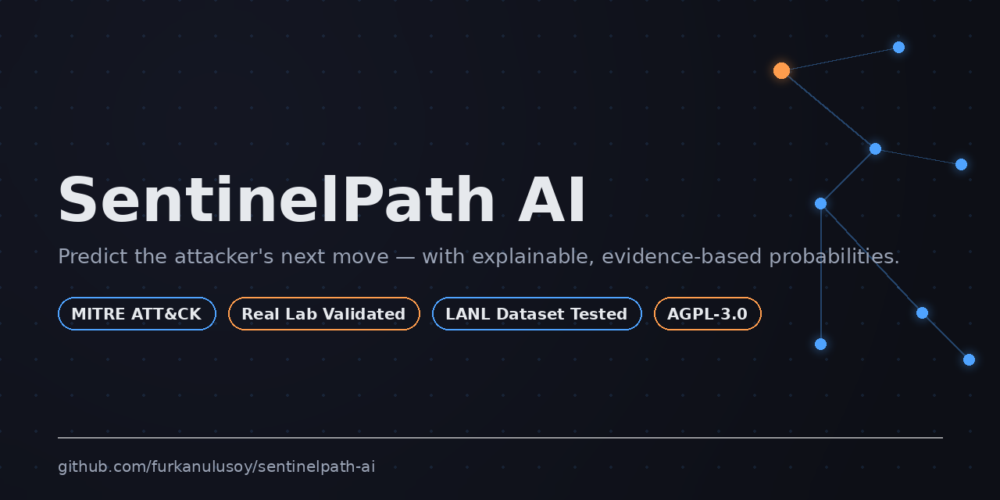
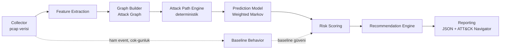
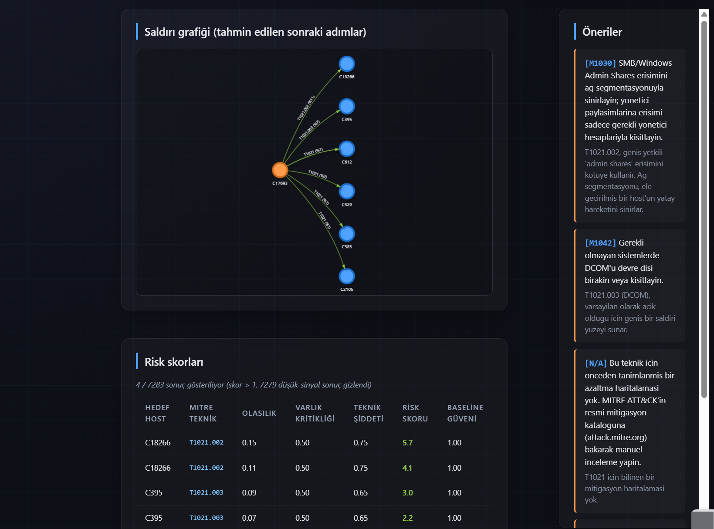
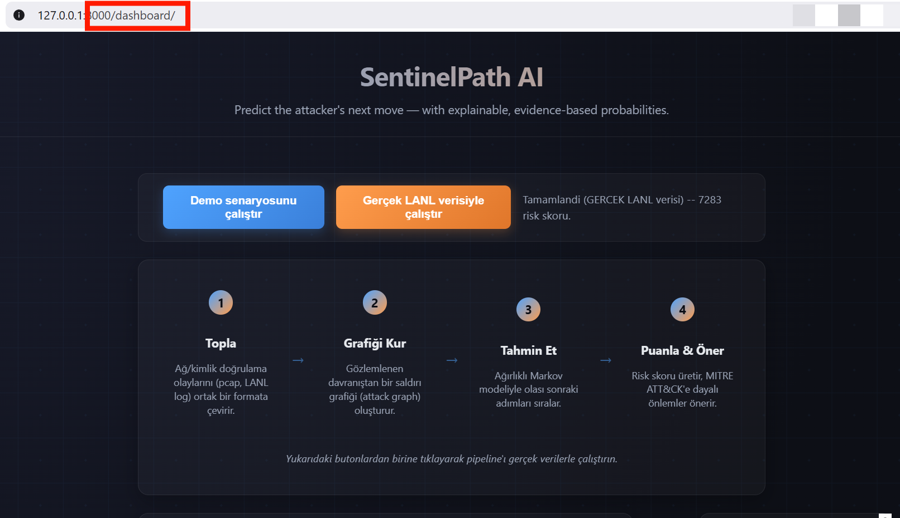

# SentinelPath AI


[](https://github.com/astral-sh/ruff)

**Predict the attacker's next move — with explainable, evidence-based probabilities.**


[English README](README.md)

## Neden SentinelPath AI?

✓ Kısmi gözlemlenen bir saldırı yolundan en olası sıradaki teknikleri sıralar
✓ MITRE ATT&CK'e doğrudan bağlı — her tahmin bir teknik ID'sine karşılık gelir
✓ Açıklanabilir risk skorlama — her sayının arkasında izlenebilir bir gerekçe var

Bugünkü güvenlik izleme/tespit platformlarının çoğu, öncelikle
gözlemlenmiş veya devam eden aktiviteyi tespit edip ona yanıt vermek
üzere optimize edilmiştir; modern EDR/NDR ürünleri giderek daha fazla
davranışsal tespit, threat hunting ve anomali skorlama yeteneği
içeriyor. SentinelPath AI, çoğu aracın kullanıcıya doğrudan sunmadığı
tamamlayıcı bir soruyu araştırıyor: **kısmi gözlemlenen bir saldırı
yolundan yola çıkarsak, sıradaki en olası teknik hangisi, ve neden?**
Akademik attack graph literatürü (MulVAL, TVA) genelde statik zafiyet
grafiğine dayanır; SentinelPath AI bunun yerine sürekli güncellenen
*davranışsal* bir attack graph kurar ve aday sonraki adımları bu grafa
karşı olasılıksal olarak sıralar — her sıralama gözlemlenen kanıta
kadar izlenebilir.

> Bu bir anomali/alarm sistemi değildir. Amaç "ne oldu"yu tespit etmek
> değil, gözlemlenen kısmi saldırı zincirinden **"sırada ne var?"**
> sorusuna, izlenebilir ve açıklanabilir bir şekilde cevap vermektir.

## Mimari



Dikkat: Baseline Behavior, kurulan grafı değil ham event akışını
doğrudan tüketir (Graph Builder'dan değil), çok günlü daha geniş bir
pencere üzerinden — bkz. ADR 0006.

Sistem, **Hexagonal Architecture (Ports & Adapters)** ile **pipeline veri
akışını** birleştiren bir mimariyle tasarlanmıştır. Detaylı diyagram,
katman gerekçeleri ve Architecture Decision Record'lar için bkz.
**[ARCHITECTURE.md](ARCHITECTURE.md)**.

## Kurulum

```bash
# Sanal ortam oluştur
python3 -m venv .venv
source .venv/bin/activate  # Windows: .venv\Scripts\activate

# Çekirdek bağımlılıkları kur
pip install -e .

# Geliştirme bağımlılıklarını da eklemek için
pip install -e ".[dev]"

# Özellik gruplarına göre (ihtiyaca göre):
pip install -e ".[api]"      # FastAPI + uvicorn
pip install -e ".[network]"  # Scapy (pasif ağ keşfi için)
pip install -e ".[ml]"       # scikit-learn, xgboost
pip install -e ".[gnn]"      # torch (Graph Neural Network, Faz 6+)
```

Ortam değişkenleri için `.env` dosyası oluşturun (bkz.
`src/sentinelpath/config/settings.py` için desteklenen alanlar,
`SENTINELPATH_` ön ekiyle):

```env
SENTINELPATH_ENVIRONMENT=development
SENTINELPATH_LOG_LEVEL=INFO
SENTINELPATH_LOG_FORMAT=console
```

## Kullanım

### Testleri çalıştırma

```bash
pip install -e ".[dev]"
pytest                                            # tüm Python testleri
node tests/dashboard/test_app_pure_functions.js   # dashboard JS testleri (Node.js gerektirir)
```

### Network Parser (Collector) — Faz 2

`.pcap` dosyasını `NormalizedEvent` listesine çeviren ilk somut Collector
adaptörü kullanıma hazır. Scapy'ye ihtiyaç duyar:

```bash
pip install -e ".[network]"
```

```python
from sentinelpath.collector.infrastructure.pcap_adapter import PcapFileCollector

collector = PcapFileCollector(pcap_path="capture.pcap")
events = collector.collect()

for event in events:
    print(event.source_host, "->", event.target_host, event.raw_action, event.mitre_technique_id)
```

Örnek çıktı (RDP ve SMB trafiği içeren bir capture için):

```
10.0.0.5 -> 10.0.0.10 tcp_connect:rdp T1021.001
10.0.0.5 -> 10.0.0.11 tcp_connect:smb_admin_shares T1021.002
10.0.0.7 -> 10.0.0.10 tcp_connect:port_8080 None
```

**Mimari not:** Bu adaptörün iç tasarımı (Scapy'ye bağımlı I/O'nun
domain çevirme mantığından ayrılması) için bkz.
[ADR 0003](docs/adr/0003-pure-translation-vs-framework-io-split.md).
Çeviri mantığı (`packet_translation.py`), Scapy KURULU OLMASA BİLE
`tests/test_packet_translation.py` ile test edilebilir.

### Feature Extraction — Faz 3

`NormalizedEvent` listesinden `HostFeatureVector` üreten kural-tabanlı
(pandas gerektirmeyen) extractor:

```python
from datetime import datetime, timezone
from sentinelpath.feature_extraction.infrastructure.rule_based_extractor import (
    RuleBasedFeatureExtractor,
)

extractor = RuleBasedFeatureExtractor()  # settings'ten iş-saati varsayılanlarını okur
vector = extractor.extract(
    host_id="10.0.0.5",
    events=events,  # Faz 2'nin PcapFileCollector'ından gelen NormalizedEvent listesi
    window_start=datetime(2026, 1, 1, tzinfo=timezone.utc),
    window_end=datetime(2026, 1, 2, tzinfo=timezone.utc),
)

print(vector.distinct_users_count, vector.failed_auth_ratio, vector.observed_techniques)
```

Örnek çıktı:

```
distinct_users_count=2 failed_auth_ratio=0.33 observed_techniques=('T1021.001', 'T1021.002')
```

**Mimari not:** `FeatureExtractorPort` imzasına Faz 3'te açık bir zaman
penceresi eklendi — gerekçesi için bkz.
[ADR 0004](docs/adr/0004-explicit-feature-window.md). Pandas'a karşı
saf-Python seçiminin gerekçesi için ARCHITECTURE.md, Faz 3 notlarına
bakınız.

### Graph Builder — Faz 4

`NormalizedEvent` listesinden ve host envanterinden bir `AttackGraphSnapshot`
üreten NetworkX tabanlı adaptör:

```python
from sentinelpath.graph_builder.infrastructure.networkx_adapter import NetworkXGraphBuilder

builder = NetworkXGraphBuilder()
snapshot = builder.build(events=events, feature_vectors=feature_vectors)

for edge in snapshot.edges:
    print(edge.source_node, "->", edge.target_node, edge.relation.value, f"(weight={edge.weight})")

# Statik topoloji bilgisini (örn. firewall/subnet erişim kuralları) birleştirmek için:
snapshot = builder.merge_static_topology(snapshot, topology_edges=[("host-a", "host-c")])
```

Örnek çıktı:

```
10.0.0.5 -> 10.0.0.10 authenticates_to (weight=1.0)
10.0.0.5 -> 10.0.0.11 observed_lateral_movement (weight=3.0)
```

**Mimari not:** `GraphBuilderPort.build()` imzasına Faz 4'te açık
`events` parametresi eklendi — gerekçesi için bkz.
[ADR 0005](docs/adr/0005-graph-builder-events-parameter.md). `DiGraph`
yerine `MultiDiGraph` seçiminin gerekçesi (aynı host çifti arasında
birden fazla ilişki tipinin aynı anda var olabilmesi) için
`networkx_adapter.py` modül docstring'ine bakınız.

### Uçtan uca demo (Faz 1-4 birlikte)

`scripts/demo_end_to_end.py`, ilk dört fazı gerçek girdi/çıktılarla
zincirler — bir lateral movement senaryosunu (RDP → SMB) ve aynı
ortamdaki normal/gündüz trafiğini aynı grafta gösterir:

```bash
PYTHONPATH=src python3 scripts/demo_end_to_end.py
```

### Baseline Behaviour — Faz 5

Ham `NormalizedEvent` geçmişinden (birden fazla günü kapsayan geniş bir
pencere) her host için "normal" davranış profili çıkarır:

```python
from sentinelpath.baseline_behavior.infrastructure.in_memory_baseline import (
    InMemoryBaselineBehavior,
)

baseline = InMemoryBaselineBehavior()
baseline.recompute(events, window_start=..., window_end=...)  # periyodik/batch çağrı

profile = baseline.get_profile("10.0.0.10")  # hızlı, senkron okuma
print(profile.confidence, profile.typical_active_hours, profile.typical_peer_nodes)
```

**Önemli:** `confidence` alanı, istenen pencereye göre GERÇEKTEN kaç gün
veri gözlemlendiğini yansıtır. Az veriyle "bu davranış anormal" iddia
etmemek için Faz 6'daki Prediction Model bu değeri hesaba katar.

**Mimari not:** `BaselineBehaviorPort.recompute()` imzası Faz 5'te
`AttackGraphSnapshot` yerine ham event + açık pencere alacak şekilde
değiştirildi — gerekçesi için bkz.
[ADR 0006](docs/adr/0006-baseline-events-and-window.md). Bu sınıf,
projedeki ilk **stateful** adaptördür (Graph Builder'ın aksine) —
gerekçesi için `in_memory_baseline.py` modül docstring'ine bakınız.

### Attack Path Prediction — Faz 6

Bu, projenin asıl değer önerisi. İki ayrı motor birlikte çalışır (bkz.
ADR 0002): **Attack Path Engine** (deterministik, sadece graf teorisi)
ve **Prediction Model** (olasılıksal sıralama).

```python
from sentinelpath.attack_path_engine.infrastructure.networkx_engine import (
    NetworkXAttackPathEngine,
)
from sentinelpath.prediction.infrastructure.weighted_markov_model import (
    WeightedMarkovPredictionModel,
)

engine = NetworkXAttackPathEngine()
candidate_paths = engine.find_candidate_paths(snapshot, start_node="10.0.0.50", max_hops=3)

predictor = WeightedMarkovPredictionModel()
result = predictor.predict(candidate_paths)

for tp in result.predictions:  # azalan olasılıkla sıralı
    print(f"%{tp.probability*100:.1f}  {tp.technique_id}  {tp.technique_name}")
```

**Model seçimi:** Random Forest, XGBoost, GNN, Temporal GNN, LSTM ve
Transformer gibi çeşitli denetimli ve temsil-öğrenme yaklaşımları
değerlendirildi ve MVP için seçilmedi — asıl sebep, projenin şu an
bunları sorumlu bir şekilde eğitecek/doğrulayacak yeterince temsili bir
etiketli veri setine ve değerlendirme çerçevesine sahip olmaması.
Isolation Forest de değerlendirildi ama farklı bir sebeple elendi: o,
denetimsiz bir anomali-skorlama yöntemi ve burada asıl çözülen problem
olan sıralı saldırı-yolu geçişlerini doğrudan modellemiyor. Bunun
yerine, gözlemlenen graf ağırlıklarından (zaten ampirik gözlem sıklığı)
doğrudan olasılık üreten, hiç eğitim verisi gerektirmeyen bir
**ağırlıklı Markov geçiş modeli** seçildi. Tam karşılaştırma tablosu ve
gerekçe için bkz.
[ADR 0009](docs/adr/0009-prediction-model-selection.md).

**Mimari not:** Bu fazda implementasyon sırasında **iki gerçek veri kaybı**
bulundu ve düzeltildi:
- `GraphEdge`, spesifik MITRE teknik ID'lerini taşımıyordu (sadece kaba
  ilişki kategorisini) — bkz. [ADR 0007](docs/adr/0007-graph-edge-technique-ids.md)
- `CandidatePath`, Prediction Model'in olasılık hesaplayabilmesi için
  gereken hop-bazlı yapılandırılmış veriyi taşımıyordu — bkz.
  [ADR 0008](docs/adr/0008-candidate-path-hop-data.md)

Ayrıca `networkx`'in bu sürümünde `all_simple_paths()`'ın `target`
parametresini artık zorunlu kıldığı canlı testler sırasında ortaya
çıktı ve düzeltildi.

### Risk Scoring — Faz 7

`PredictionResult`'i alıp her tahmin için `probability × asset_criticality
× technique_severity` formülüyle bir risk skoru (0-100) üretir:

```python
from sentinelpath.risk_scoring.infrastructure.config_based_risk_scoring import (
    ConfigBasedRiskScoring,
)

risk_scorer = ConfigBasedRiskScoring(
    asset_criticality_map={"10.0.0.20": 0.95, "10.0.0.10": 0.9},  # kurumun kendi varlık envanteri
)
risk_scores = risk_scorer.score(prediction, baseline_profiles=baseline_profiles)

for rs in risk_scores:  # azalan skora göre sıralı
    print(rs.target_node, rs.score, rs.baseline_confidence)
```

**Mimari not:** `RiskScore`'a Faz 7'de `baseline_confidence` alanı
eklendi — ama **ana formüle karıştırılmadı**, ayrı bir bağlam alanı
olarak taşınıyor. Gerekçesi için bkz.
[ADR 0010](docs/adr/0010-risk-score-baseline-confidence.md). Bu,
Faz 6'nın "düşük güvenin skoru artırması mı azaltması mı gerektiği
belirsiz" tespitine dürüst bir cevaptır: nihai yorumu insana bırakır.

`TECHNIQUE_SEVERITY` tablosundaki değerler resmi CVSS skorları
**değildir** — CVSS'nin CVE'lere (zafiyetlere) atandığını, MITRE
ATT&CK tekniklerine değil, unutmamak gerekir. Bunlar alan bilgisine
dayanan makul varsayımlardır (Faz 6'daki `RELATION_PRIORITY` ile aynı
ruhta).

### Recommendation Engine + Reporting — Faz 8 (MVP'nin son fazı)

**Not:** Recommendation Engine, orijinal 10 fazlık yol haritasında ayrı
bir faz olarak listelenmemişti, ama Faz 1'in kendi pipeline diyagramında
(Risk Scoring → Recommendation Engine → Reporting) vardı — Reporting'in
`SentinelPathReport`'u kurabilmesi için `recommendations` alanının dolu
olması gerektiğinden, bu ikisi birlikte tamamlandı.

```python
from sentinelpath.recommendation.infrastructure.rule_based_recommender import (
    RuleBasedRecommendationEngine,
)
from sentinelpath.reporting.infrastructure.json_reporting import JSONReporting
from sentinelpath.core.models import SentinelPathReport
from datetime import datetime, timezone

recommendations = RuleBasedRecommendationEngine().recommend(risk_scores)

report = SentinelPathReport(
    target_node="10.0.0.50", risk_scores=tuple(risk_scores),
    recommendations=tuple(recommendations),
    generated_at=datetime.now(timezone.utc), pipeline_version="0.1.0",
)

reporter = JSONReporting()
json_output = reporter.to_json(report)
navigator_layer = reporter.to_attack_navigator_layer(report)
```

Gerçek pipeline çıktısından üretilmiş örnek dosyalar `examples/`
klasöründe bulunur:
- `examples/sample_report.json` — genel amaçlı JSON rapor
- `examples/sample_navigator_layer.json` — bu dosya doğrudan
  [MITRE ATT&CK Navigator](https://mitre-attack.github.io/attack-navigator/)'a
  "Open Existing Layer → Upload from local" ile yüklenip
  görselleştirilebilir.

**Mimari not:** Navigator layer şeması, implementasyon öncesi resmi
MITRE spesifikasyonuna (`layerformat.md`, v4.5) karşı doğrulandı.
`versions.attack` alanı bilerek atlandı — hangi ATT&CK veri sürümüne
karşılık geldiğini iddia etmek, veri seti güncellenince yanlış olabilir
(alan opsiyonel). Risk skoru gradyanı MITRE'nin kendi örnek layer'inin
tersi yönde tasarlandı (bizim bağlamımızda yüksek skor = kötü = kırmızı).

### Dashboard — Faz 9

Faz 2-8'de yazılan tüm bileşenleri zincirleyen bir **PipelineOrchestrator**
(saf Python, hiçbir web framework'üne bağımlı değil), bunu HTTP üzerinden
sunan bir **FastAPI uygulaması**, ve bunu görselleştiren **statik bir
HTML/vanilla JS dashboard**.

```bash
pip install -e ".[api]"
uvicorn sentinelpath.api.main:app --reload
```

Sonra tarayıcıda `http://localhost:8000/dashboard/` açılıp "Demo
senaryosunu çalıştır" butonuna basılabilir — risk skoru tablosu,
öneriler ve `vis-network` ile çizilmiş bir saldırı grafiği görüntülenir.
API dokümantasyonu otomatik olarak `http://localhost:8000/docs`
adresinde oluşturulur (FastAPI'nin OpenAPI desteği sayesinde).

**Mimari not:** `PipelineOrchestrator`, ADR 0003'teki desenin bir web
framework'üne uygulanmış hali olarak bilerek framework-bağımsız yazıldı
— bkz. [ADR 0011](docs/adr/0011-dashboard-tech-stack.md). Dashboard'ın
JavaScript'i de aynı prensiple ikiye bölündü: DOM'a bağımlı olmayan saf
fonksiyonlar (`buildGraphData`, `riskColor`, vb.) Node.js altında test
edildi (20/20 test, bkz. `tests/dashboard/test_app_pure_functions.js`).

### Deployment — Faz 10

```bash
# Docker Compose ile:
docker compose up --build
# http://localhost:8000/dashboard/

# Veya doğrudan Docker ile:
docker build -t sentinelpath-ai .
docker run -p 8000:8000 sentinelpath-ai
```

CI/CD, GitHub Actions ile sağlanır (`.github/workflows/ci.yml`):
Python 3.11/3.12 matrisi, `ruff` lint, `mypy` tip kontrolü, CI'ın
desteklediği opsiyonel bağımlılık gruplarıyla (`api`, `network`, `ml`)
tam `pytest` paketi, Node.js dashboard testleri, ve bir Docker build
doğrulaması. `gnn` grubu (`torch`) bilerek CI'a dahil edilmedi — ağır
bir bağımlılık ve henüz hiçbir GNN implementasyonu yok (bkz. ADR 0009);
dahil etmek, hiçbir kapsama katkısı olmadan CI'ı sadece yavaşlatırdı.

Docker imajı çok-aşamalı (multi-stage) build kullanır — derleme araçları
(gcc vb.) yalnızca `builder` aşamasında kalır, final `runtime` imajı
bunları içermez (saldırı yüzeyini küçültmek, bir güvenlik aracı için
tematik olarak da tutarlı). Konteyner root olmayan bir kullanıcıyla
çalışır ve `GET /health` üzerinden bir `HEALTHCHECK` tanımlıdır.

Deployment yığını kararlarının tam gerekçesi için bkz.
[ADR 0012](docs/adr/0012-deployment-tech-stack.md).

## Proje Durumu

Planlanan 10 geliştirme fazının tamamı bitti. İlk 8 faz MVP kapsamını
oluşturuyor; Faz 9 (Dashboard) ve Faz 10 (Deployment) yukarıda kendi
bölümlerinde belgelenmiştir. Bu, tamamlanmış bir *yol haritasını*
yansıtıyor, üretim olgunluğunu değil — proje hâlâ bir
araştırma/prototip sistemi ve henüz kurumsal üretim ölçeğinde
doğrulanmadı.

> Şu anki test paketi CI'da geçiyor (111 test). Sistem gerçek network
> trafiğiyle (Wireshark capture) uçtan uca doğrulanmıştır, ancak
> büyük ölçekli bir üretim ortamında henüz doğrulanmamıştır. Bkz.
> aşağıdaki "Bilinen Sınırlamalar" ve "Gelecek Planı" bölümleri.

| Faz | İçerik | Durum |
|---|---|---|
| 1 | Repository, Architecture, Documentation | ✅ Tamamlandı |
| 2 | Network Parser (Collector — pcap → NormalizedEvent) | ✅ Tamamlandı |
| 3 | Feature Extraction (NormalizedEvent → HostFeatureVector) | ✅ Tamamlandı |
| 4 | Graph Builder (NetworkX MultiDiGraph adapter) | ✅ Tamamlandı |
| 5 | Baseline Behaviour (event geçmişi → BaselineProfile) | ✅ Tamamlandı |
| 6 | Attack Path Prediction (Attack Path Engine + Weighted Markov Model) | ✅ Tamamlandı |
| 7 | Risk Scoring (probability × criticality × severity + baseline context) | ✅ Tamamlandı |
| 8 | Reporting (Recommendation Engine + JSON/ATT&CK Navigator export) | ✅ Tamamlandı (MVP) |
| 9 | Dashboard (PipelineOrchestrator + FastAPI + statik HTML/JS) | ✅ Tamamlandı |
| 10 | Deployment (Docker + docker-compose + GitHub Actions CI) | ✅ Tamamlandı |

Her faz sonunda bağımsız çalışabilen bir ürün ortaya çıkacak şekilde
ilerlenmiştir; bir sonraki faza geçmeden önce README.md ve
ARCHITECTURE.md güncellenmiştir.

## Örnek Çıktı

`scripts/demo_end_to_end.py`'nin gerçek çalıştırılmasından alınmış çıktı
(RDP + SMB tabanlı bir lateral movement senaryosu):

```
Model: weighted_markov_v1
Tahminler (10.0.0.50 için, azalan olasılıkla):
  %75.0  T1021.002    Remote Services: SMB/Windows Admin Shares
  %25.0  T1021.001    Remote Services: Remote Desktop Protocol
```

Bu, hiçbir eğitim verisi olmadan, sadece gözlemlenen graf ağırlıklarından
ve MITRE ATT&CK ilişkilendirmesinden türetildi (bkz.
[ADR 0009](docs/adr/0009-prediction-model-selection.md)).

### Gerçek Lab Doğrulaması

Sistem, kendi VirtualBox lab ortamında (host → Windows 10 → Windows
Server 2022, SMB + RDP zinciri) gerçek network trafiğiyle uçtan uca
test edildi. Pipeline, gözlemlenen kanıt hacmine göre saldırganın
Windows Server'a kadar ilerlediğini doğru şekilde öngördü (T1021.001,
%100 göreli olasılık), düşük baseline güvenini de dürüstçe işaretleyerek.

Bu gerçek veri testi, hiçbir sentetik demonun ortaya çıkaramayacağı iki
gerçek hata buldu:
- **Paket vs. bağlantı sayımı** — her TCP paketini ayrı bir "bağlantı"
  sayan bir tasarım, uzun süreli oturumları (örn. RDP) kısa olanlara
  (örn. bir SMB gezinmesi) göre ağır bastırıyordu — bkz.
  [ADR 0013](docs/adr/0013-packet-vs-connection-counting.md)
- **Önceden kurulmuş bağlantının yakalanması** — bağlantı zaten
  kurulduktan *sonra* başlatılan bir capture, ilk el sıkışmayı hiç
  yakalamadı, o hop için sıfır event üretti

İkisi de bulundu, düzeltildi ve ADR olarak belgelendi — tam olarak
sentetik test verisinin yapısal olarak ortaya çıkaramayacağı türden bir
sorun.

### Gerçek Dünya Veri Seti Doğrulaması (LANL)

Kendi kurduğumuz lab'ın ötesinde, sistem
[LANL Comprehensive Multi-Source Cyber-Security Events veri seti](https://csr.lanl.gov/data/cyber1/)'ne
karşı da doğrulandı — gerçek bir kurumsal ağdan, 58 günlük, anonimleştirilmiş
gerçek trafik, etiketli kırmızı takım aktivitesi dahil. Bu veriyi okumak
için iki yeni Collector adaptörü (`LANLAuthCollector`, `LANLFlowsCollector`)
yazıldı — sistemin geri kalanında kullanılan **aynı** pipeline'dan geçerek,
özel bir mantık eklenmeden.




Bu veri setinden doğrulanmış gerçek bir saldırgan host'una karşı tam
pipeline'ı çalıştırmak, hiçbirinin sentetik testte hiç ortaya çıkmadığı
üç gerçek, büyük-ölçek bulgusu ortaya çıkardı:
- On milyonlarca gerçek kaydı işlerken, toplu-işleme odaklı event
  toplama tasarımında bir bellek taşması hatası (bkz. ADR 0016)
- Yoğun, gerçek bir kurumsal ağ grafiğinde Attack Path Engine'in yol
  aramasında kombinatoryal patlama (tek bir başlangıç noktasından 2.3
  milyon aday yol) — test edilmiş motor koduna dokunmadan, sadece
  konfigürasyonla çözüldü (bkz. ADR 0016)
- T1046 (Discovery) dedektörü ile T1021 (Lateral Movement) teknikleri
  arasında gerçek bir kapsam sınırı: doğrulanmış gerçek saldırgan, geniş
  bir tarama değil, dar ve tekrarlayan bir erişim deseni kullanmıştı —
  bu yüzden discovery dedektörü onu **doğru şekilde** işaretlemedi, bu
  bir kusur değil, dedektörün hassasiyetini doğrulayan bir bulgu
  (bkz. ADR 0015)

## Bilinen Sınırlamalar

ADR'lerle aynı ruhta, burada da dürüst olmak gerekiyor — yukarıdaki
"10/10 faz tamamlandı" çerçevesinin abartıya kaçmaması için, bu
sistemin *henüz* yapmadıkları:

- **Üretim ölçeğinde doğrulanmadı.** Şu ana kadarki tüm gerçek veri
  testi, küçük, kendi kurduğumuz bir lab (2-3 host). Büyük bir kurumsal
  ağda hiç kullanılmadı.
- **UDP bağlantı sayımı çözülmedi.** ADR 0013'teki düzeltme sadece
  TCP'ye (SYN-tabanlı) uygulanıyor; UDP'de bağlantı kavramı olmadığı
  için UDP-ağırlıklı protokoller (örn. RDP'nin grafik kanalı) hâlâ edge
  ağırlıklarını şişirebilir. Kabul edilen geçici çözüm ve gelecek yönü
  için bkz. ADR 0013.
- **Prediction Model, eğitilmiş bir model değil, frekans-tabanlı bir
  sezgiseldir.** Nedeni ve hangi koşullarda denetimli bir modelle
  değiştirilmesi gerektiği için bkz. ADR 0009.
- **Kalıcılık katmanı yok.** `InMemoryBaselineBehavior` ve tüm pipeline
  durumu sadece bellekte yaşıyor; şu an hiçbir şey süreç yeniden
  başlatıldığında hayatta kalmıyor.
- **MITRE mitigation haritalaması küçük.** `RuleBasedRecommendationEngine`
  şu an yalnızca T1021.* alt-tekniklerini ve T1078'i kapsıyor — bu
  kümenin dışındaki teknikler genel bir "MITRE ATT&CK'e bakın" mesajına
  düşüyor.
- **Canlı/akış yakalama yok.** Collector `.pcap` dosyaları okur;
  gerçek zamanlı paket dinleme bilinçli olarak ertelendi (bkz. ADR 0003).

## Proje Yapısı

```
sentinelpath-ai/
├── ARCHITECTURE.md          ← mimari kararlar ve gerekçeleri
├── docs/adr/                ← Architecture Decision Records
├── examples/                ← gerçek pipeline çıktısından üretilmiş örnek raporlar
├── Dockerfile, docker-compose.yml, .dockerignore
├── .github/workflows/ci.yml
├── src/sentinelpath/
│   ├── core/models.py       ← paylaşılan domain veri sözleşmeleri
│   ├── config/settings.py   ← tip-güvenli konfigürasyon
│   ├── logging_setup.py     ← yapılandırılmış (JSON) loglama
│   ├── orchestration/        ← PipelineOrchestrator (framework-bağımsız)
│   ├── api/                  ← FastAPI katmanı (ince, orchestrator'ı sarar)
│   ├── static/dashboard/      ← statik HTML/CSS/JS dashboard (paketin içinde)
│   └── <module>/
│       ├── domain/ports.py         ← soyut arayüz (Protocol)
│       ├── application/            ← use-case'ler
│       └── infrastructure/         ← somut implementasyonlar
└── tests/
    └── dashboard/            ← dashboard JS'in saf fonksiyonları için Node.js testleri
```

Her pipeline aşaması (`collector`, `feature_extraction`, `graph_builder`,
`baseline_behavior`, `attack_path_engine`, `prediction`, `risk_scoring`,
`recommendation`, `reporting`) aynı `domain/application/infrastructure`
desenini takip eder. Gerekçe için bkz. ARCHITECTURE.md, bölüm 4.

## Gelecek Planı

Hangisinin en çok ileriki işi açacağına göre önceliklendirildi — önce
temel altyapı, en son ileri düzey ML.

**Katman 1 — Temel altyapı**
1. Akış/generator tabanlı event işleme (ADR 0016'da bulunan bellek
   sınırlamasını çözer — herhangi bir büyük ölçekli çalıştırmadan önce gerekli)
2. Kalıcılık katmanı (SQLite/PostgreSQL) — şu an tüm durum bellekte,
   yeniden başlatmada kayboluyor
3. Ground-truth veri seti + baseline karşılaştırması + tam LANL veri
   setine karşı Top-K/MRR değerlendirmesi (1. maddeye bağımlı)

**Katman 2 — Aracın kendi güvenliği**
4. `SECURITY.md` + `THREAT_MODEL.md` (telemetri zehirlenmesi, baseline
   manipülasyonu, kötü niyetli girdi işleme; bağımlılık ve gizli-anahtar
   taramasının etkinleştirilmesini de içerir)
5. Bozuk/düşmanca girdi dosyalarına karşı sertleştirilmiş doğrulama

**Katman 3 — Tespit döngüsünü kapatmak**
6. Aktif olay müdahale modu: doğrulanmış bir ele geçirilmiş host için,
   önceliklendirilmiş bir eylem listesi ve Jira/ServiceNow tarzı iş
   akışları için bir taslak talep üretir
7. Analist geri bildirim döngüsü — bir tahmini doğru/yanlış işaretlemek,
   gelecekteki denetimli modeller için etiketli bir veri setine doğru ilerlemek
8. Yanlış-pozitif bastırma — bir analistin tekrarlayan zararsız bir
   deseni (örn. bir yedekleme sunucusu) işaretleyip bir daha
   gösterilmemesini sağlaması
9. Tahmin edilen teknikler için Sigma kural önerileri
10. Bir risk eşiğinin üzerinde gerçek zamanlı bildirim (Slack/e-posta/webhook)
11. Tehdit istihbaratı paylaşımı için STIX/TAXII export

**Katman 4 — Veri kaynağı genişliği**
12. Yerel Sysmon entegrasyonu
13. Yerel Zeek entegrasyonu
14. UDP 5-tuple flow toplama (bkz. ADR 0013'teki bilinen sınırlama)

**Katman 5 — Ürün kullanılabilirliği**
15. Kuruma göre özelleştirilebilir teknik-şiddet ve mitigasyon tabloları
16. "Neden bu tahmin?" açıklama paneli (kenar ağırlığı, rakip adaylar,
    baseline güveni, tek bir görünümde)
17. Host başına tarihsel trend görünümü (Katman 1, 2. maddeye bağımlı)
18. Rol tabanlı erişim kontrolü
19. Adaptif baseline kalibrasyonu — `BaselineBehaviorPort`'un sabit bir
    pencere yerine, yeterli veri gözlemlenince "öğrenme"den "aktif
    tespit"e geçmesi (bkz. ADR 0015)

**Katman 6 — Üretim sertleştirmesi**
20. API versiyonlama ve hız sınırlama
21. Container sertleştirmesi (read-only filesystem, SBOM, imaj sabitleme)

**Katman 7 — İleri düzey ML**
22. Ağırlıklı Markov baseline'dan Graph Neural Network / Temporal Graph
    Network'e geçiş, Katman 1'in baseline metriklerine karşı titiz bir
    karşılaştırmalı değerlendirmeyle (bkz. ADR 0009) — bilerek en sonda:
    ölçülmemiş bir baseline'a karşı karşılaştırma yapmak anlamsız olurdu
23. Topluluk katkılı "attack path dataset" formatı

## Katkıda Bulunma

Bu proje açık kaynak bir araştırma platformu olarak tasarlanmıştır.
Mimari kararlar hakkında soru sormadan önce ARCHITECTURE.md ve
`docs/adr/` klasörüne bakmanız önerilir — birçok "neden böyle?" sorusunun
cevabı zaten orada gerekçeli olarak yazılıdır.

## Lisans

AGPL-3.0 — bkz. [LICENSE](LICENSE).

